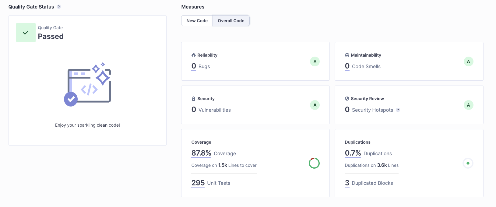

# GenioService

> **Version :** 1.0.0-release  
> **Auteur :** Elsa HADJADJ  
> **Email :** elsa.simha.hadjadj@gmail.com  
> **GitHub Repository :** [https://github.com/DUT-Info-Montreuil/genio-backend](https://github.com/DUT-Info-Montreuil/genio-backend)

---

## Projet académique

Ce projet a été développé dans le cadre de la troisième année du Bachelor Universitaire de Technologie (BUT Informatique) à l’IUT de Montreuil.

**GenioService** est une application de gestion de conventions de stage permettant la génération, l’historisation, la validation et le suivi documentaire.

---

## Audit qualité SonarQube

  

**Résultat : Quality Gate – Passed  ✅**
- Sécurité : 0 vulnérabilité
- Fiabilité : 0 bug
- Maintenabilité : 0 code smell
- Couverture de tests : 87.8% (295 tests unitaires)
- Duplication : 0.7% (3 blocs dupliqués)

> OWASP Dependency-Check : 0 failles
---

## Sommaire

- [00 - Introduction](docs/00-introduction.md)
- [01 - Architecture technique](docs/01-architecture.md)
- [02 - Installation & prérequis](docs/02-installation.md)
- [03 - Déploiement (dev & prod)](docs/03-deploiement.md)
- [04 - Documentation fonctionnelle](docs/04-doc-fonctionnelle.md)
- [05 - Design UX & Parcours utilisateur](docs/05-ux.md)
- [06 - Sécurité & RGPD](docs/06-rgpd.md)
- [Changelog](CHANGELOG.md)
- [Licence (CC BY-NC-SA 4.0)](licence.md)
