# Documentation fonctionnelle – GenioService

---

## Sommaire

- [Page d’Accueil](#page-daccueil)
- [Écran de connexion](#écran-de-connexion)
- [Écran d’inscription](#écran-dinscription)
- [Écran de réinitialisation du mot de passe](#écran-de-réinitialisation-du-mot-de-passe)
- [Écran de réinitialisation du mot de passe - nouveau mot de passe](#écran-de-réinitialisation-du-mot-de-passe---nouveau-mot-de-passe)
- [Écran de consultation des modèles – Consultant](#écran-de-consultation-des-modèles--consultant)
- [Écran de consultation des modèles – Exploitant](#écran-de-consultation-des-modèles--exploitant)
- [Écran de consultation des modèles – Gestionnaire](#écran-de-consultation-des-modèles--gestionnaire)
- [Écran de visualisation de l’historique des conventions – Exploitant](#écran-de-visualisation-de-lhistorique-des-conventions--exploitant)
- [Écran de visualisation de l’historique des conventions – Gestionnaire](#écran-de-visualisation-de-lhistorique-des-conventions--gestionnaire)
- [Écran de gestion des modèles – Gestionnaire](#écran-de-gestion-des-modèles--gestionnaire)
  - [Sous-onglet : Ajouter un modèle](#sous-onglet--ajouter-un-modèle)
  - [Sous-onglet : Modifier un modèle](#sous-onglet--modifier-un-modèle)
  - [Sous-onglet : Archiver un modèle](#sous-onglet--archiver-un-modèle)
- [Écran de gestion des utilisateurs – Gestionnaire](#écran-de-gestion-des-utilisateurs--gestionnaire)
- [Page – Plan du site](#page--plan-du-site)
- [Page – À propos de GenioService](#page--à-propos-de-genioservice)
- [Page – Contact](#page--contact)
- [Page – Politique de confidentialité](#page--politique-de-confidentialité)
- [Pages - Mentions légales](#page--mentions-légales)
- [Conditions Générales d’Utilisation (CGU)](#page--conditions-générales-dutilisation-cgu)

## Page d’Accueil

### Objectif de page d'accueil

L’écran d’accueil de GenioService est la porte d’entrée principale de l’application.
Il permet à l’utilisateur d’accéder aux trois grandes fonctionnalités du service :

- Consulter des modèles prêts à l’emploi
- Gérer les modèles existants
- Consulter l’historique des conventions

---

### Aperçu de page d'accueil

<!-- markdownlint-disable MD033 -->
<div>
  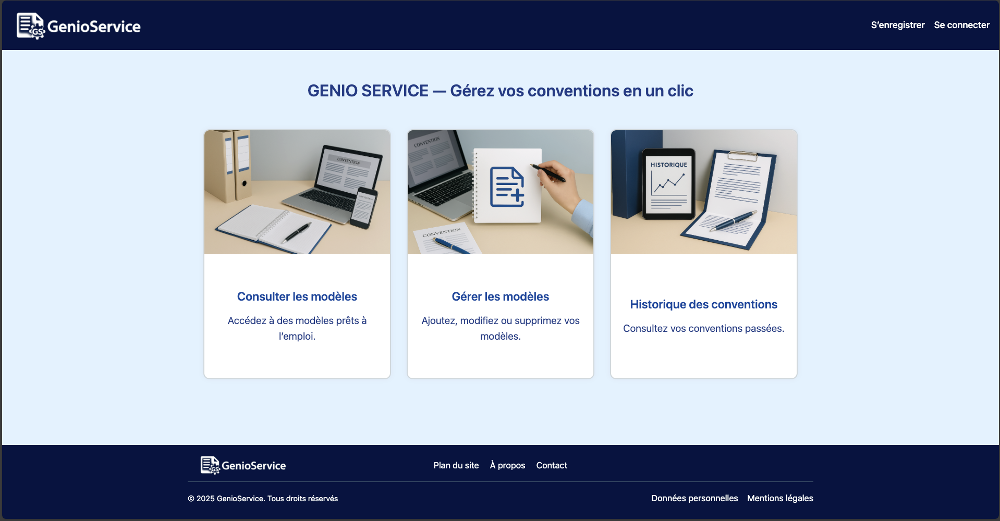
</div>

---

### Fonctionnement de page d'accueil

- La Page d’Accueil est composée de **trois cartes interactives**.
- Chaque carte redirige vers la page de **connexion** (/connexion) si l’utilisateur n’est pas encore connecté.
- Une fois connecté, l’utilisateur accède à la fonctionnalité selon ses droits.

**Les trois cartes affichées :**

1. **Consulter les modèles**
   Permet d’accéder à des modèles de conventions prêts à l’emploi.

2. **Gérer les modèles**
   Permet d’ajouter, modifier ou supprimer des modèles.

3. **Historique des conventions**
   Permet de visualiser les conventions déjà générées.

---

### Exigences fonctionnelles de page d'accueil

- L’écran est **accessible sans authentification**.
- Les liens mènent tous vers la **page de connexion**.
- L’accès aux fonctionnalités est ensuite **filtré par rôle** utilisateur (décrit dans une section séparée de la documentation).
- Chaque carte est cliquable et bien lisible (titre + image + descriptif).
- Le design est **responsive** pour une utilisation sur desktop et mobile.

---

### Exigences techniques de page d'accueil

- Application Angular 17
- routerLink vers /connexion utilisé sur chaque carte
- Images en loading="lazy" pour optimiser le chargement
- aria-label présent pour l’accessibilité
- Texte masqué avec .visually-hidden pour les lecteurs d’écran
- Structure HTML sémantique (main, nav, article, etc.)
- Mise en page responsive (grille adaptative CSS)

---

## Écran de connexion

### Objectif de page de connexion

Permet à l’utilisateur de s’authentifier pour accéder à son espace GenioService.
Obligatoire pour consulter, gérer ou visualiser des conventions.

---

### Aperçu de page de connexion

<!-- markdownlint-disable MD033 -->
<div>
  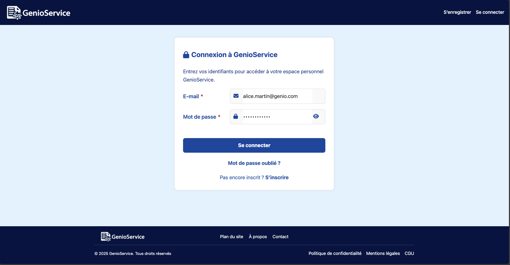
</div>

---

### Fonctionnement de page de connexion

- L’utilisateur saisit son **email** et son **mot de passe**.
- Le bouton **“Se connecter”** déclenche une requête d’authentification (POST /auth/login).
- En cas d’échec, un **message d’erreur** s’affiche dynamiquement (401 ou 403).
- En cas de succès :
  - Le rôle est récupéré via GET /api/utilisateurs/me
  - L’utilisateur est redirigé automatiquement vers la page consulter-modeles.
- Un lien **“Mot de passe oublié ?”** permet de réinitialiser le mot de passe.
- Un lien **“S’inscrire”** est accessible pour les nouveaux utilisateurs.

---

### Exigences fonctionnelles de page de connexion

- Tous les champs sont **obligatoires** (required HTML).
- Le champ **email** doit respecter un format valide.
- L’utilisateur est informé en cas d'erreur (email ou mot de passe incorrect / compte non activé).
- L'utilisateur peut **afficher/masquer le mot de passe** avec un bouton toggle.
- Les champs sont **accessibles au clavier** et compatibles lecteur d’écran (aria-*).
- Le lien vers la réinitialisation de mot de passe est visible sans être connecté.
- En cas de succès, un **message de confirmation** est affiché.

---

### Exigences techniques de page de connexion

- **Framework** : Angular 17
- **Composants utilisés** : FormsModule, NgIf, RouterLink
- **Services utilisés** :
  - HttpClient pour l’appel à l’API /auth/login
  - AuthService pour enregistrer l’utilisateur connecté
- **Gestion des erreurs** :
  - 401 → identifiants invalides
  - 403 → compte en attente de validation
  - Autres → message générique
- **Mot de passe** :
  - Minimum 12 caractères (côté validation serveur)
  - Possibilité d’affichage/masquage (fa-eye, fa-eye-slash)
- **Accessibilité** :
  - Champs annotés avec aria-label, aria-describedby, aria-invalid
  - Structure HTML claire avec role="form" et aria-labelledby
- **Design** :
  - Bouton désactivé pendant l’envoi ([disabled]="isSubmitting")
  - Composant responsive avec marges et alignements optimisés
  - Messages animés et temporisés (effacement automatique après 5 sec)

---

## Écran d’inscription

### Objectif de page d'inscription

Permet à un nouvel utilisateur de créer un compte GenioService.
C’est l’étape préalable à toute utilisation du service.

---

### Aperçu de la page d'inscription

<!-- markdownlint-disable MD033 -->
<div>
  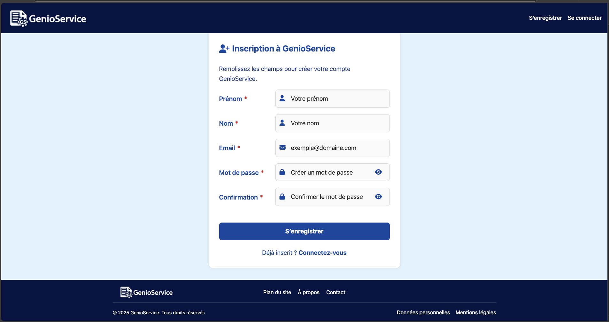
</div>

---

### Fonctionnement de page d'inscription

- L’utilisateur doit renseigner :
  - **Prénom**
  - **Nom**
  - **Adresse e-mail**
  - **Mot de passe**
  - **Confirmation du mot de passe**
  - **Case à cocher obligatoire** :  
    _Je déclare avoir pris connaissance et accepte les [Conditions Générales d’Utilisation](/cgu) et la [Politique de confidentialité](/confidentialite)._

- Une fois tous les champs valides :
  - Le bouton **S’enregistrer** envoie les données via `POST /api/utilisateurs`
  - L’adresse e-mail est vérifiée pour **unicité** en temps réel (`GET /api/utilisateurs/exists`)
  - Si inscription réussie, l’utilisateur est redirigé vers la page de **connexion**
  - En cas d’erreur, un message clair est affiché en haut du formulaire

- Le formulaire inclut une **vérification dynamique du mot de passe** :
  - Les règles non respectées s’affichent en **badges rouges** sous le champ
  - Elles disparaissent une à une dès qu’elles sont respectées

---

### Exigences fonctionnelles de page d'inscription

- Tous les champs sont **obligatoires** (required)
- Le mot de passe doit respecter **toutes les règles suivantes** :
  - Minimum **12 caractères**
  - Contenir **au moins 1 majuscule**
  - Contenir **au moins 1 chiffre**
  - Contenir **au moins 1 caractère spécial**
- Les mots de passe et la confirmation doivent être **identiques**
- L’adresse e-mail doit être **unique** dans la base de données
- La **case à cocher RGPD est obligatoire** :
  - Elle doit être cochée pour permettre l’envoi du formulaire
  - En cas d’absence de consentement, un message d’erreur s’affiche :  
    _Vous devez accepter les conditions pour vous inscrire._
- En cas d’erreur, un message s’affiche en haut du formulaire, puis disparaît automatiquement après quelques secondes
- **Accessibilité** :
  - `aria-label`, `aria-live`, `aria-describedby` intégrés
  - Compatible avec la **navigation clavier** et les **lecteurs d’écran**
- **Responsive** : fonctionne sur PC et mobile

---

### Exigences techniques de page d'inscription

- **Framework** : Angular 17
- **Composants** : FormsModule, NgIf, NgForOf, RouterLink
- **Logique Angular** :
  - Requête POST /api/utilisateurs avec Content-Type: application/json
  - Requête GET /api/utilisateurs/exists?email= pour la vérification d’unicité
- **Sécurité** :
  - Aucun mot de passe transmis en clair
  - Affichage/masquage des champs mot de passe via bouton fa-eye
- **Accessibilité & UX** :
  - Badges d’erreur discrets pour les règles non respectées
  - Bouton désactivé pendant l’envoi ([disabled]="isSubmitting")
  - Aria busy actif durant le chargement
- **Redirection** :
  - Succès → redirection vers /connexion après 2 secondes

---

## Écran de réinitialisation du mot de passe

### Objectif de la page de réinitialisation du mot de passe

Permet à l’utilisateur de demander un lien de réinitialisation de mot de passe par email.
Cette fonctionnalité est destinée aux utilisateurs ayant oublié leur mot de passe.

---

### Aperçu de la page de réinitialisation du mot de passe

<!-- markdownlint-disable MD033 -->
<div>
  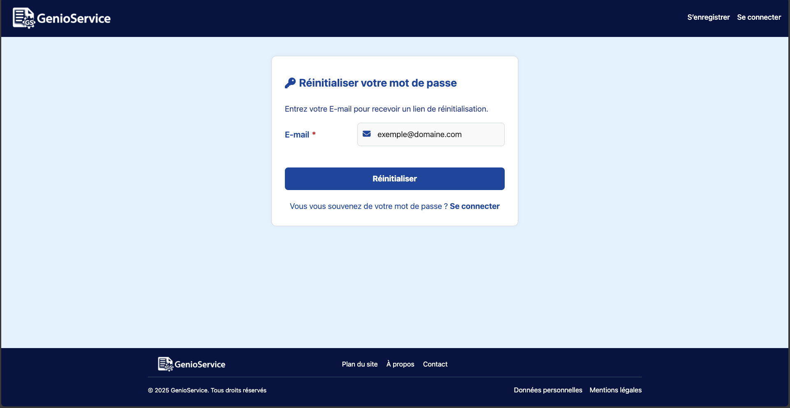
</div>

---

### Fonctionnement de la page de réinitialisation du mot de passe

- L’utilisateur saisit son **adresse e-mail** dans le champ prévu.
- En cliquant sur le bouton **"Réinitialiser"**, une requête `POST /auth/mot-de-passe-oublie` est envoyée.
- Si l’email est associé à un compte existant :
  - Un email de réinitialisation est envoyé.
  - Un **message de succès** s’affiche : _"Un e-mail de réinitialisation a été envoyé si votre adresse est enregistrée."_
- En cas d’erreur (problème réseau ou format invalide), un **message d’erreur clair** s’affiche dynamiquement.
- Un lien **"Se connecter"** permet de revenir à la page de connexion.

---

### Exigences fonctionnelles de la page de réinitialisation du mot de passe

- Champ **e-mail obligatoire** et validé (`required` + format email)
- Envoi sécurisé de la requête au backend (`POST`)
- Affichage :
  - D’un **message d’erreur** en cas d’échec
  - D’un **message de confirmation** identique que l’email existe ou non
- Accessibilité :
  - `aria-label`, `aria-describedby`, `aria-invalid`, `aria-live`
  - Navigation **clavier** et **lecteurs d’écran** supportés
- Focus automatique sur le champ e-mail à l’ouverture
- Message **neutre** pour éviter les attaques par énumération
- Bouton désactivé pendant la soumission
- Redirection manuelle possible vers la page de connexion

---

### Exigences techniques de la page de réinitialisation du mot de passe

- **Framework** : Angular 17
- **Composants Angular** : `FormsModule`, `NgIf`, `NgClass`, `RouterLink`
- **API** :
  - `POST /auth/mot-de-passe-oublie` avec `Content-Type: application/json`
- **Accessibilité & UX** :
  - Formulaire avec `aria-labelledby="reset-title"`
  - `aria-describedby` dynamique selon l’état d’erreur
  - Bouton avec `aria-busy` pendant l’envoi
  - Messages intégrés dans `aria-live="polite"` pour lecteurs d’écran
- **Sécurité** :
  - Message neutre, même si l’e-mail n’est pas enregistré
  - Aucune donnée sensible affichée côté frontend
- **Design** :
  - Interface centrée, responsive
  - Message de succès temporaire (2 secondes)
  - Message d’erreur temporaire (5 secondes)

---

## Écran de réinitialisation du mot de passe - nouveau mot de passe

### Objectif de la page de réinitialisation du mot de passe - nouveau mot de passe

Cet écran permet à l’utilisateur de définir un **nouveau mot de passe** après avoir cliqué sur le lien reçu par email.
C’est la dernière étape de la procédure “Mot de passe oublié”.

---

### Aperçu de la page de réinitialisation du mot de passe - nouveau mot de passe

<!-- markdownlint-disable MD033 -->
<div>
  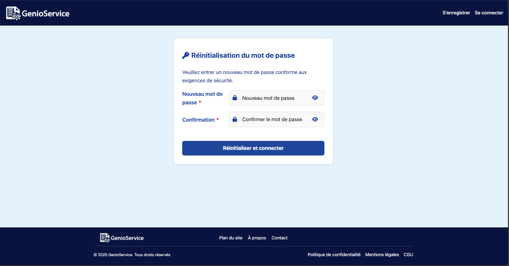
</div>

---

### Fonctionnement de la page de réinitialisation du mot de passe - nouveau mot de passe

- L’utilisateur saisit :
  - Un **nouveau mot de passe**
  - Une **confirmation de ce mot de passe**
- Une **vérification dynamique** affiche les règles non respectées.
- Une fois toutes les règles respectées :
  - Le bouton **"Réinitialiser et connecter"** devient actif.
  - Une requête `POST /auth/reset-password` est envoyée avec le **token** en paramètre.
- En cas de succès :
  - Le mot de passe est mis à jour.
  - L’utilisateur est automatiquement redirigé vers la **page de connexion** après 2 secondes.
- En cas d’erreur :
  - Un message d’erreur s’affiche dynamiquement.

---

### Exigences fonctionnelles de la page de réinitialisation du mot de passe - nouveau mot de passe

- Champs obligatoires : **nouveau mot de passe** et **confirmation**
- Le mot de passe doit respecter toutes les **règles de sécurité** :
  - Minimum **12 caractères**
  - Contenir **1 majuscule**
  - Contenir **1 chiffre**
  - Contenir **1 caractère spécial**
- Le mot de passe et sa confirmation doivent **être identiques**
- Un **feedback en temps réel** indique les règles non respectées (badges rouges)
- Un **message de succès** ou d'erreur est affiché dynamiquement
- Accessibilité :
  - `aria-label`, `aria-describedby`, `aria-live`
  - Champs accessibles via le clavier
  - Affichage/Masquage du mot de passe possible (`fa-eye`, `fa-eye-slash`)

---

### Exigences techniques de la page de réinitialisation du mot de passe - nouveau mot de passe

- **Framework** : Angular 17
- **Composants Angular** : `FormsModule`, `NgIf`, `NgForOf`
- **API** :
  - `POST /auth/reset-password` avec `token` et `nouveauMotDePasse`
- **Sécurité** :
  - Aucune information sensible stockée en local
  - Le token est lu dans `queryParams` pour sécuriser le lien
- **UX & accessibilité** :
  - Validation instantanée des règles de mot de passe
  - Bouton désactivé pendant la soumission (`[disabled]="isSubmitting"`)
  - Message temporaire (succès ou erreur)

---

## Écran de consultation des modèles – Consultant

### Objectif de la page de consultation des modèles – Consultant

Permet aux utilisateurs ayant le rôle **Consultant** de consulter les modèles de conventions disponibles dans GenioService.

Cette interface offre un accès en **lecture seule** à l’ensemble des modèles enregistrés, sans possibilité de modification, ajout ou archivage.
Elle constitue l’interface de consultation standard, simple et sécurisée.

---

### Aperçu de la page de consultation des modèles – Consultant

<!-- markdownlint-disable MD033 -->
<div>
  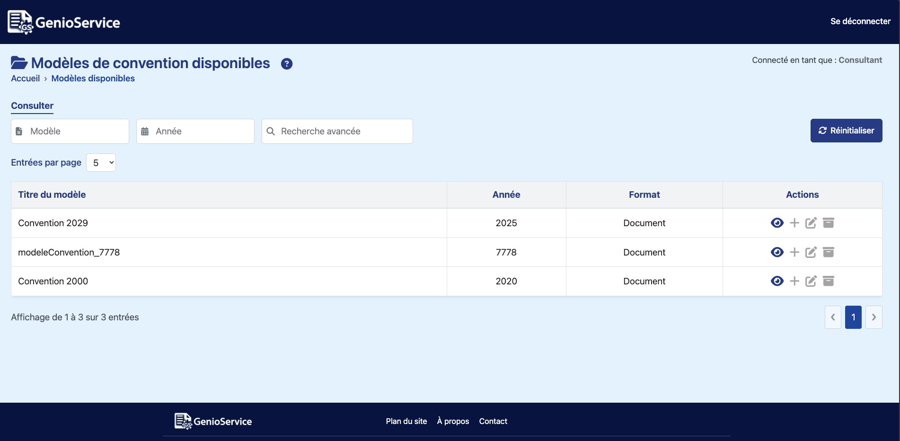
</div>

---

### Fonctionnement de la page de consultation des modèles – Consultant

- L’interface se compose d’un tableau listant tous les modèles de convention enregistrés.
- L’utilisateur **Consultant** peut :
  - Filtrer les modèles par **nom**, **année**, ou **recherche avancée** (texte libre)
  - Consulter les détails d’un modèle (via l’icône œil)
  - Voir les **variables attendues** dans une modale (affichage limité avec bouton “Voir toutes les variables”)
- Les actions suivantes sont **désactivées et grisées** :
  - ➕ Ajouter un modèle
  - ✏️ Modifier un modèle
  - 🗃️ Archiver un modèle
- Aucun bouton de gestion des utilisateurs n’est présent.
- Aucun accès à l’onglet “Visualiser”.
- En haut à droite, un badge affiche le rôle actuel :

  > Connecté en tant que : **Consultant**

---

### Exigences fonctionnelles de la page de consultation des modèles – Consultant

- **Rôle requis** : Consultant
- Les fonctionnalités disponibles sont strictement limitées à la **consultation** :
  - Visualisation du modèle
  - Filtres actifs (nom, année, recherche avancée)
  - Consultation des variables attendues (via modale)
- Les actions de gestion (ajout, édition, archivage) sont **désactivées**
- Affichage des champs :
  - Titre du modèle
  - Année
  - Format
  - Statut d’utilisation
- Les champs de filtre sont accessibles à tous les rôles

---

### Exigences techniques de la page de consultation des modèles – Consultant

- **Framework** : Angular 17
- **Composants utilisés** :
  - `ConsulterModeleTousComponent`
  - `RouterLink` pour la navigation
- **Droits et sécurité** :
  - Vérification du rôle via `AuthService.isConsultant()`
  - Aucune possibilité d’accéder à `/gerer-modeles`
  - Les actions POST, PUT et DELETE sont bloquées côté frontend et backend
- **Accessibilité (WCAG)** :
  - Boutons désactivés avec `aria-disabled="true"` et `title="Réservé au gestionnaire"`
  - Focus clavier activé sur les lignes du tableau
  - Icônes annotées (`aria-label`, `aria-hidden`)
  - Modale accessible (`role="dialog"`, `aria-labelledby`, `aria-describedby`)
- **UX & Design** :
  - Boutons non autorisés grisées (`disabled-style`)
  - Badge “Connecté en tant que : Consultant”
  - Aide ❔ en haut à droite ouvrant une modale d’explication

---

## Écran de consultation des modèles – Exploitant

### Objectif de la page de consultation des modèles – Exploitant

Permet aux utilisateurs ayant le rôle Exploitant de consulter les modèles de conventions disponibles.

Cette interface reprend celle du Consultant, avec quelques différences fonctionnelles et visuelles,
notamment l’accès à l’onglet “Visualiser” pour suivre les tentatives de génération de conventions.

---

### Aperçu de la page de consultation des modèles – Exploitant

<!-- markdownlint-disable MD033 -->
<div>
  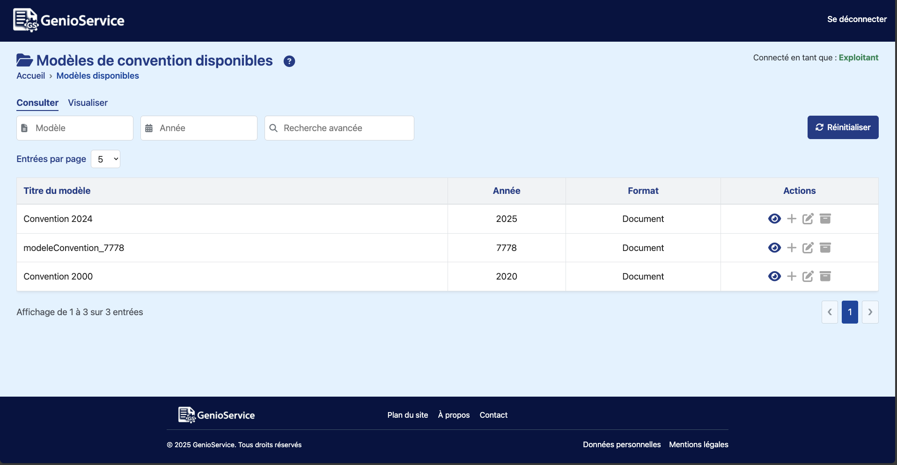
</div>

---

### Fonctionnement de la page de consultation des modèles – Exploitant

- L’exploitant accède à une interface identique à celle du consultant, à l’exception de deux éléments :
  - Un **badge vert** en haut à droite : Connecté en tant que : Exploitant
  - Un **onglet supplémentaire “Visualiser”** affiché dans la barre de navigation
  - Les actions affichées dans le tableau sont toutes **grisés et inactives** (lecture seule) :
    - 👁️ Voir le modèle : **actif**
    - ➕ Ajouter : **désactivé**
    - ✏️ Modifier : **désactivé**
    - 🗃️ Archiver : **désactivé**
- En cliquant sur l’onglet “Visualiser”, l’exploitant accède **à la page d’historique des générations.**
- Aucune cloche de notification, aucun bouton de gestion des utilisateurs n’est visible (réservé au Gestionnaire).

---

### Exigences fonctionnelles de la page de consultation des modèles – Exploitant

- Rôle requis : Exploitant
- Le tableau permet :
  - Filtrage par nom, année, texte libre
  - Visualisation des détails d’un modèle (modale)
- Les boutons ➕ ✏️ 🗃️ sont visibles mais non interactifs
- L’onglet **Visualiser** est exclusif au rôle Exploitant et Gestionnaire

---

### Exigences techniques de la page de consultation des modèles – Exploitant

- **Framework** : Angular 17
- **Composants Angular** :
  - ConsulterModeleTousComponent
  - RouterLink vers /historique-conventions
  - AuthService.isExploitant() pour activer le rôle

- **Sécurité** :
  - Droits contrôlés en frontend et backend
  - Actions d’édition désactivées (grisés via disabled-style)
  - Blocage complet de /gerer-modeles

- **UX & accessibilité** :
  - Boutons inactifs signalés avec aria-disabled="true"
  - Icônes grisées avec title="Réservé au gestionnaire"
  - Clavier uniquement sur la visualisation (fa-eye)
  - Focus rétabli après navigation
  - Affichage clair du rôle connecté

- **Design** :
  - Badge Connecté en tant que : Exploitant vert
  - Onglet “Visualiser” visible uniquement pour les exploitants
  - Pas de cloche, pas de gestion utilisateurs

---

## Écran de consultation des modèles – Gestionnaire

### Objectif de la page de consultation des modèles – Gestionnaire

Permet aux utilisateurs ayant le rôle Gestionnaire de consulter les modèles de conventions disponibles, avec des droits complets sur chaque ligne (ajout, modification, archivage).
Cette page est une version enrichie de la vue “Consultant”, avec des outils d’administration intégrés.

---

### Aperçu de la page de consultation des modèles – Gestionnaire

<!-- markdownlint-disable MD033 -->
<div>
  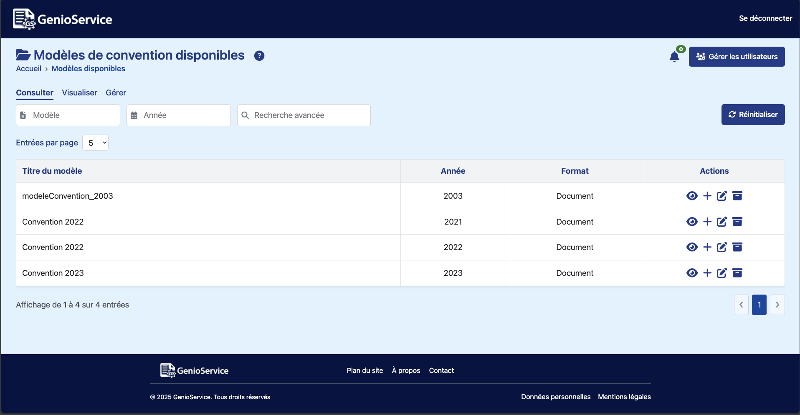
</div>

---

### Fonctionnement de la page de consultation des modèles – Gestionnaire

- La page est identique à celle du Consultant en apparence, mais avec :
  - Une **cloche de notification** pour visualiser les demandes d’habilitation utilisateurs.
  - Un **bouton “Gérer les utilisateurs”** pour accéder à l’administration des comptes.
  - **Toutes les actions activées** dans la colonne “Actions” du tableau :
    - 👁️ Voir le modèle
    - ➕ Ajouter un modèle (redirige vers l’onglet “Ajouter”)
    - ✏️ Modifier un modèle (redirige vers l’onglet “Modifier” avec le modèle préchargé)
    - 🗃️ Archiver un modèle (redirige vers l’onglet “Archiver” avec confirmation)
- En cliquant sur ces icônes, l’utilisateur est redirigé vers l’interface de gestion des modèles avec l’onglet correspondant actif (ajouter, modifier, ou archiver).
- La cloche en haut à droite indique le nombre de demandes d’habilitation en attente :

  - ✅ badge vert si aucune demande
  - 🔴 badge rouge si une ou plusieurs demandes
  - Un message temporaire s’affiche à l’ouverture de la cloche
- Le bouton “Gérer les utilisateurs” permet d’accéder à la page dédiée (non accessible aux autres rôles).

---

### Exigences fonctionnelles de la page de consultation des modèles – Gestionnaire

- Rôle requis : Gestionnaire
- Le tableau permet :
  - Filtrage par nom, année, texte libre
  - Consultation des détails
  - Ajout direct
  - Modification immédiate
  - Archivage immédiat
- Les boutons d’action sont interactifs uniquement pour les gestionnaires :
  - Désactivés ou absents pour les autres rôles
  - Accessibles au clavier (avec Tab + Enter)
- En tête enrichi :
  - Cloche d’habilitation visible uniquement pour les gestionnaires
  - Bouton “Gérer les utilisateurs” accessible avec focus clavier

---

### Exigences techniques

- **Framework** : Angular 17
- **Composants Angular** :
  - ConsulterModeleTousComponent
  - RouterLink avec queryParams ({ onglet: 'ajouter' | 'modifier' | 'archiver' })
  - AuthService pour vérifier le rôle utilisateur
- **Sécurité** :
  - Vérification du rôle en frontend et backend
  - Redirection sécurisée selon droits
- **UX & accessibilité** :
  - Boutons annotés (aria-label, aria-disabled)
  - Clavier compatible sur toutes les actions
  - Focus automatique sur tableau à chaque navigation
  - Icône de notification : aria-haspopup, aria-live
- Design :
  - Icônes : 👁️ fa-eye, ➕ fa-plus, ✏️ fa-edit, 🗃️ fa-archive
  - Badge dynamique sur cloche (vert/rouge)
  - Messages temporaires (toast ou infobulle)

---

## Écran de visualisation de l’historique des conventions – Exploitant

### Objectif de la page de visualisation de l’historique des conventions – Exploitant

Permet aux utilisateurs de type **Exploitant** d’accéder à l’historique des tentatives de génération de conventions, avec un détail sur les étapes de traitement (Flux, JSON, DOCX) et la possibilité d’en consulter les erreurs.

---

### Aperçu de la page de visualisation de l’historique des conventions – Exploitant

<!-- markdownlint-disable MD033 -->
<div>
  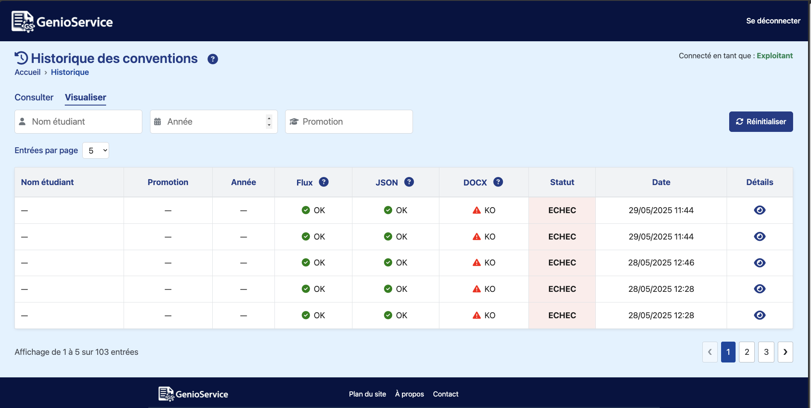
</div>

---

### Fonctionnement de la page de visualisation de l’historique des conventions – Exploitant

- Liste paginée des tentatives de génération de conventions.
- Filtres disponibles :
  - Par **Nom d’étudiant**
  - Par **Promotion**
  - Par **Année** (via datalist)
- Pour chaque ligne :
  - Les étapes **Flux**, **JSON** et **DOCX** sont évaluées avec des icônes ✔️ (OK) ou ⚠️ (KO)
  - La colonne **Statut** indique si la tentative globale est un **SUCCÈS** ou un **ÉCHEC**
  - La **Date** de génération est affichée
  - Une icône 👁️ permet d’accéder au **détail de l’erreur** si disponible
- Une **modale d’aide** (❔) fournit un rappel sur l’usage de la page
- Des icônes d’aide supplémentaires sont disponibles dans l’en-tête de chaque étape

---

### Exigences fonctionnelles de la page de visualisation de l’historique des conventions – Exploitant

- **Rôle requis** : Exploitant (affiché en haut à droite)
- Accès en lecture seule aux historiques
- Les statuts intermédiaires sont :
  - **Flux** : transformation des données d'entrée
  - **JSON** : validation du contenu des champs
  - **DOCX** : génération du document final
- La logique métier affiche KO si une étape échoue, avec détails si présents
- Aucun bouton de modification n’est présent

---

### Accessibilité de la page de visualisation de l’historique des conventions – Exploitant

- Icônes annotées (`aria-label`)
- Focus clavier activé sur les lignes
- Modales accessibles (`role=dialog`, `aria-labelledby`)
- Navigation paginée avec touches (`Enter`, `Tab`)
- Texte alternatif pour icônes et boutons

---

### Exigences techniques de la page de visualisation de l’historique des conventions – Exploitant

- **Framework** : Angular 17
- **Contrôle d’accès** : via `AuthService.isExploitant()`
- **Source des données** : `GET /api/genio/historique`
- Classe CSS dynamique pour le statut (`status-error`, `status-success`)
- Pagination configurable (5, 10, 15 lignes)
- Détail d’erreur affiché dans une modale
- Analyse automatisée des erreurs selon le contenu de `details`

---

### Aide intégrée de la page de visualisation de l’historique des conventions – Exploitant

- Bouton ❔ général : explication du fonctionnement de l'écran
- Boutons ❔ spécifiques pour :
  - **Flux** : erreurs de format, d’ID modèle manquant, etc.
  - **JSON** : erreurs de validation de champs
  - **DOCX** : erreurs d’export ou fichier manquant
- Ces aides ouvrent une modale explicative contextualisée

---

## Écran de visualisation de l’historique des conventions – Gestionnaire

### Objectif de la page de visualisation de l’historique des conventions – Gestionnaire

Permet aux utilisateurs ayant le rôle **Gestionnaire** de consulter l’ensemble des tentatives de génération de conventions enregistrées dans le système.

Cette interface est **identique à celle de l’Exploitant** sur le fond et les fonctionnalités, mais avec une **affichage distinct du rôle** et l’accès parallèle aux fonctions de gestion.

---

### Aperçu de la page de visualisation de l’historique des conventions – Gestionnaire

<!-- markdownlint-disable MD033 -->
<div>
  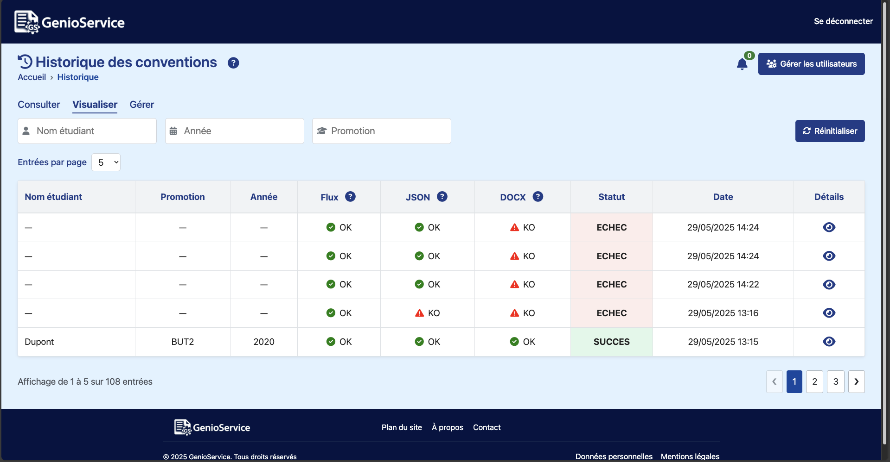
</div>

---

### Fonctionnement de la page de visualisation de l’historique des conventions – Gestionnaire

- Le tableau liste toutes les **tentatives de génération de conventions**, paginées.
- Chaque ligne présente :
  - Le **Nom de l’étudiant**
  - La **Promotion**
  - L’**Année**
  - Le **statut de chaque étape** :
    - ✔️ OK ou ❌ KO pour les phases **Flux**, **JSON**, **DOCX**
  - Le **statut global** : `SUCCÈS` ou `ÉCHEC`
  - La **date** de la tentative
  - Un bouton 👁️ pour accéder au **détail de l’erreur**
- Les **filtres disponibles** en haut de page :
  - Nom d’étudiant
  - Année
  - Promotion
- Un bouton **❔ d’aide globale** est affiché pour expliquer le fonctionnement.
- Des **icônes d’aide spécifiques** sont également visibles dans l’en-tête de chaque colonne (Flux, JSON, DOCX).
- Aucune action d’édition ou de suppression n’est présente.

---

### Exigences fonctionnelles de la page de visualisation de l’historique des conventions – Gestionnaire

- **Rôle requis** : Gestionnaire
- Consultation complète de l’historique des générations :
  - Détails par tentative
  - Statuts intermédiaires par étape
  - Affichage chronologique
- Lecture seule : aucune modification, suppression ou export
- Modale détaillée disponible via l’icône 👁️

---

### Accessibilité de la page de visualisation de l’historique des conventions – Gestionnaire

- Navigation au **clavier** (touches `Tab`, `Enter`)
- Icônes avec attributs `aria-label` et `aria-hidden`
- Boutons d’ouverture de modale accessibles
- Filtrage accessible aux lecteurs d’écran
- Modales conformes WCAG (`role="dialog"`, `aria-labelledby`, etc.)

---

### Exigences techniques de la page de visualisation de l’historique des conventions – Gestionnaire

- **Framework** : Angular 17
- **Composant principal** : `HistoriqueConventionsComponent`
- **Contrôle d’accès** :
  - Vérification via `AuthService.isGestionnaire()`
  - Interface identique à l’exploitant mais badge différent
- **Données** :
  - Récupérées via `GET /api/genio/historique`
  - Formatées pour affichage paginé
  - Champs analysés : nom, promotion, année, statuts
- **CSS dynamique** :
  - `status-success` (vert) pour SUCCÈS
  - `status-error` (rouge) pour ÉCHEC
- **Design & UX** :
  - Icônes d’aide dans l’en-tête de colonnes
  - Bouton général ❔ pour guide d’utilisation
  - Pagination fluide et focus maintenu

---

### Aide intégrée de la page de visualisation de l’historique des conventions – Gestionnaire

- **Bouton ❔ général** : affichage d’une modale expliquant l’usage de la page
- **Boutons ❔ contextuels** dans chaque colonne :
  - **Flux** : transformation des données en entrée
  - **JSON** : validation des champs requis
  - **DOCX** : génération du document final
- Ces icônes ouvrent des **modales d’aide spécifiques et contextualisées**

---

## Écran de gestion des modèles – Gestionnaire

### Objectif de la page de gestion des modèles – Gestionnaire

Permet aux utilisateurs ayant le rôle **Gestionnaire** d’ajouter, modifier ou archiver des modèles de conventions au format `.docx`.
C’est la seule interface ayant un contrôle complet sur le référentiel de modèles disponibles dans le système.

---

### Accès et rôles de la page de gestion des modèles – Gestionnaire

- **Rôle requis** : `Gestionnaire`
- L'accès est contrôlé dans Angular via : `AuthService.isGestionnaire()`
- Les rôles **Exploitant** et **Consultant** n’ont pas accès à cette page
- Si un utilisateur non autorisé tente d’y accéder, il est redirigé

---

### Fonctionnement général de la page de gestion des modèles – Gestionnaire

L’écran se divise en **trois sous-onglets** :

1. **Ajouter un modèle**
   Permet d’importer un nouveau modèle `.docx` :
     - Champ obligatoire : année du modèle (format `YYYY`)
     - Upload par glisser-déposer ou bouton “Choisir un fichier”
     - Type accepté : `.docx` uniquement
     - Taille maximale : 4 Mo
     - Un champ facultatif permet de saisir le titre du modèle

2. **Modifier un modèle**
   Permet de :
     - Rechercher un modèle existant
     - Modifier son titre
     - Visualiser les métadonnées
     - Mettre à jour la description ou l’année (si autorisé)

3. **Archiver un modèle**
   Permet de désactiver un modèle existant :
     - Le modèle archivé devient invisible aux autres rôles
     - L’action est irréversible sauf réactivation manuelle via backend

---

### Aperçu de l’interface de la page de gestion des modèles – Gestionnaire

<!-- markdownlint-disable MD033 -->
<div>
  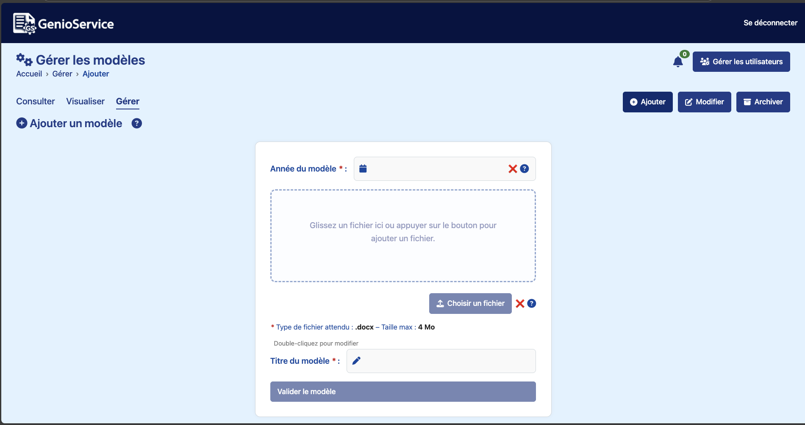
</div>
---

### Exigences fonctionnelles de la page de gestion des modèles – Gestionnaire

- L’écran affiche dynamiquement les onglets selon le rôle
- Les actions sont accessibles uniquement au **Gestionnaire**
- Les champs de formulaire sont validés côté client
- Un feedback clair est affiché :
  - Message de succès si action réussie
  - Message d’erreur si format ou fichier invalide
- En cas d’import incorrect :
  - Une modale s’ouvre avec le détail des erreurs
  - Les erreurs de variable (manquante, malformée) sont explicitées

---

### Exigences techniques de la page de gestion des modèles – Gestionnaire

- **Framework** : Angular 17
- **Composants** :
  - `AjouterModeleComponent`
  - `ModifierModeleComponent`
  - `SupprimerModeleComponent`
- **Services utilisés** :
  - `AuthService` pour la gestion du rôle
  - `HttpClient` pour les appels `/api/modeles`
- **Sécurité** :
  - Vérification du rôle côté frontend et backend
  - Fichier `.docx` analysé pour détecter les variables attendues
- **Accessibilité** :
  - `aria-label`, `aria-live`, `aria-modal` sur toutes les zones interactives
  - Focus clavier et navigation au `Tab` fonctionnels
- **Responsive** :
  - Design adapté desktop et tablette
  - Affichage flexible selon taille de l’écran

---

### Aide intégrée de la page de gestion des modèles – Gestionnaire

- Un bouton ❔ d’aide est affiché dans chaque sous-onglet
- Une modale explique les attentes de chaque section
- Un encart de notification indique les demandes d’habilitation en attente

---

## Sous-onglet : Ajouter un modèle

Ce sous-onglet permet à un **Gestionnaire** d’importer un nouveau modèle de convention au format `.docx`.
Le fichier est automatiquement analysé pour valider sa structure, l’année et la présence des variables attendues.

---

### Aperçu de l’interface  - Sous-onglet : Ajouter un modèle

<!-- markdownlint-disable MD033 -->
<div>
  
</div>

---

### Fonctionnement - Sous-onglet : Ajouter un modèle

1. **Année du modèle** :
     - Champ obligatoire au format `YYYY`
     - Validation stricte : comprise entre `2020` et `{{ currentYear + 5 }}`
     - Vérification d’unicité via l’API `GET /check-nom-exists`

2. **Fichier modèle** :
     - Accepté : `.docx` uniquement – Taille maximale : `4 Mo`
     - Téléversement par **drag-and-drop** ou bouton "Choisir un fichier"
     - Analyse automatique via `POST /test-generation` :
       - Vérifie que le document contient des **variables de champs attendues** (ex. `NOM_ETUDIANT`, `TUT_IUT`, etc.)
       - Retour visuel ✔️ / ❌ pour chaque variable détectée

3. **Titre du modèle** :
     - Auto-généré à partir du nom du fichier si vide
     - Modifiable manuellement : double-clic ou clic sur l’icône 🖉

4. **Soumission** :
     - Le bouton "Valider le modèle" est activé uniquement si tous les champs sont valides
     - Envoie des données via `POST /conventionServices` (multipart)

---

### Cas d’erreurs - Sous-onglet : Ajouter un modèle

- **Année invalide** : modale explicative avec message d’aide
- **Modèle déjà existant pour l’année** : blocage automatique et message clair
- **Fichier sans variable** : message "Ce fichier ne semble pas être un modèle"
- **Fichier partiel** : affichage des variables manquantes avec bouton "Voir plus"
- **Autre erreur backend** : message d’erreur retourné ou générique affiché

---

### Exigences fonctionnelles - Sous-onglet : Ajouter un modèle

- Tous les champs sont requis pour soumettre
- Vérification dynamique de l’année et du fichier à chaque modification
- Affichage clair des messages de succès ou d’erreur
- Accessibilité complète :
  - Attributs `aria-label`, `aria-invalid`, `aria-live`
  - Comportement compatible avec la navigation au clavier
- Interface responsive adaptée aux écrans mobiles

---

### Exigences techniques - Sous-onglet : Ajouter un modèle

- **Framework** : Angular 17
- **Composant utilisé** : `AjouterModeleComponent`
- **Services API** :
  - `GET /check-nom-exists`
  - `POST /test-generation`
  - `POST /conventionServices`
- **Gestion d’état locale** :
  - Propriétés : `annee`, `isAnneeValid`, `selectedFile`, `isFileValid`, `titre`, `titreEditable`, `message`, `error`
  - Comportement réactif sur tous les champs avec déclenchement de modales en cas d’erreur

---

### Variables attendues analysées automatiquement

Voici la liste complète des variables attendues analysées par `docxParser` :

```plaintext
annee, NOM_ORGANISME, ADR_ORGANISME, NOM_REPRESENTANT_ORG, QUAL_REPRESENTANT_ORG,
NOM_DU_SERVICE, TEL_ORGANISME, MEL_ORGANISME, LIEU_DU_STAGE, NOM_ETUDIANT1,
PRENOM_ETUDIANT, SEXE_ETUDIANT, DATE_NAIS_ETUDIANT, ADR_ETUDIANT,
TEL_ETUDIANT, MEL_ETUDIANT, SUJET_DU_STAGE, DATE_DEBUT_STAGE, DATE_FIN_STAGE,
STA_DUREE, _STA_JOURS_TOT, _STA_HEURES_TOT, TUT_IUT, TUT_IUT_MEL,
PRENOM_ENCADRANT, NOM_ENCADRANT, FONCTION_ENCADRANT, TEL_ENCADRANT,
MEL_ENCADRANT, NOM_CPAM, Stage_Professionnel, STA_REMU_HOR
```

---

### Astuce UX

- Un clic sur l’icône **❔** à côté du champ "Année" ou "Fichier" ouvre une **modale d’aide contextuelle** avec les détails d’erreurs ou les variables attendues non détectées.
- En cas de fichier partiel, un bouton "Afficher toutes les variables" permet de voir les champs manquants ou incorrects.

---

### Accès restreint

- **Rôle requis** : uniquement **GESTIONNAIRE**
- Ce sous-onglet est invisible pour les rôles **Exploitant** ou **Consultant**

## Sous-onglet : Modifier un modèle

Ce sous-onglet permet au **Gestionnaire** de rechercher, visualiser et modifier un modèle existant.

---

### Aperçu de l’interface - Sous-onglet : Modifier un modèle

<!-- markdownlint-disable MD033 -->
<div>
  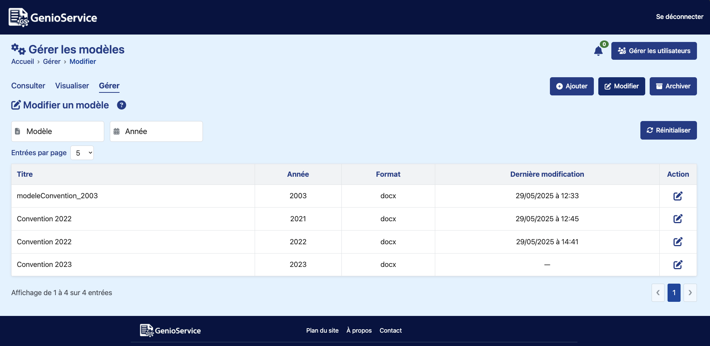
</div>

---

### Fonctionnement - Sous-onglet : Modifier un modèle

1. **Filtres de recherche** :
     - Par **nom de modèle** (texte libre, insensible à la casse et aux accents)
     - Par **année** (champ numérique avec datalist dynamique)
     - Recherche avancée possible sur la description et les statuts

2. **Affichage des modèles** :
     - Tableau dynamique avec colonnes : **Titre**, **Année**, **Format**, **Dernière modification**, **Action**
     - Pagination ajustable (5, 10, 15 entrées par page)

3. **Modification d’un modèle** :
     - Icône ✏️ pour ouvrir la modale d’édition
     - Champs modifiables dans la modale :
       - **Titre** : modifiable (double-clic ou clic sur icône crayon)
       - **Description de modification** (textarea facultatif)
       - **Remplacement du fichier .docx** (optionnel, avec vérification automatique)
     - Vérifications appliquées :
       - Le titre est modifiable uniquement si l’utilisateur le déverrouille
       - Le fichier `.docx` est validé par `/test-generation` : variables manquantes signalées

4. **Sauvegarde** :
     - Si un nouveau fichier est sélectionné :
       - Upload via `PUT /conventionServices/{id}/file` avec FormData
       - Puis mise à jour du modèle via `PUT /conventionServices/{id}` avec les métadonnées
     - Si aucun fichier : seul le `PUT` principal est appelé
     - Affichage d’un message de succès ou d’erreur
     - Fermeture automatique de la modale après succès

---

### Exigences fonctionnelles - Sous-onglet : Modifier un modèle

- Accès restreint au **rôle GESTIONNAIRE**
- Le bouton **Réinitialiser** remet tous les filtres à zéro
- La table est réactualisée dynamiquement après chaque mise à jour
- Le fichier `.docx` doit contenir toutes les variables attendues pour être accepté
- Message d’erreur si fichier invalide, format incorrect ou contenu non exploitable
- Messages d’état visibles en haut de page (`aria-live="polite"`)

---

### Exigences techniques - Sous-onglet : Modifier un modèle

- **Composant Angular** : `ModifierModeleComponent`
- **Fichiers CSS** :
  - `modifier-modele.component.css`
  - `modal-box.css`, `tables-common.css`, etc.
- **Fonctionnalités Angular** :
  - `ngModel` pour le binding
  - `@ViewChild` pour le focus clavier
  - `ChangeDetectorRef` pour les détections manuelles après traitement asynchrone
  - `normalize()` utilisé pour rendre les filtres plus robustes
- **Accessibilité** :
  - Navigation clavier, rôles ARIA (`aria-label`, `aria-modal`, `aria-live`...)
  - Focus placé automatiquement au début du tableau après changement de page
- **Messages et UX** :
  - Message temporaire en cas de succès ou d’erreur (callouts avec styles dédiés)
  - Icônes explicites pour chaque action (modification, réinitialisation...)

---

### Analyse du fichier remplacé

- Lorsqu’un fichier est sélectionné, il est envoyé à `/test-generation`
- Le backend renvoie les variables détectées dans le `.docx`
- Comparaison locale avec la liste attendue :

```ts
[
  'annee', 'NOM_ORGANISME', 'ADR_ORGANISME', 'NOM_REPRESENTANT_ORG',
  'QUAL_REPRESENTANT_ORG', 'NOM_DU_SERVICE', 'TEL_ORGANISME', 'MEL_ORGANISME',
  'LIEU_DU_STAGE', 'NOM_ETUDIANT1', 'PRENOM_ETUDIANT', 'SEXE_ETUDIANT',
  'DATE_NAIS_ETUDIANT', 'ADR_ETUDIANT', 'TEL_ETUDIANT', 'MEL_ETUDIANT',
  'SUJET_DU_STAGE', 'DATE_DEBUT_STAGE', 'DATE_FIN_STAGE', 'STA_DUREE',
  '_STA_JOURS_TOT', '_STA_HEURES_TOT', 'TUT_IUT', 'TUT_IUT_MEL',
  'PRENOM_ENCADRANT', 'NOM_ENCADRANT', 'FONCTION_ENCADRANT',
  'TEL_ENCADRANT', 'MEL_ENCADRANT', 'NOM_CPAM', 'Stage_Professionnel', 'STA_REMU_HOR'
]
```

- Si des variables sont manquantes ou si aucune n’est détectée, un message clair s’affiche
- Le fichier n’est accepté que s’il contient **toutes** les variables attendues

---

### Exemples

✅ **Succès** :
> Modèle mis à jour avec succès !

⚠️ **Erreur** :
> Le document est un modèle mais il manque 2 variables : `TUT_IUT`, `MEL_ORGANISME`.

❌ **Fichier non exploitable** :
> Ce fichier ne semble pas être un modèle de convention (aucun champ détecté).

---

### Accès restreint - Sous-onglet : Modifier un modèle

- **Rôle requis** : GESTIONNAIRE
- Le composant et ses boutons ne sont pas affichés aux autres rôles (désactivation complète)

## Sous-onglet : Archiver un modèle

Ce sous-onglet permet au **Gestionnaire** d’archiver un modèle de convention devenu obsolète.

---

### Aperçu de l’interface - Sous-onglet : Archiver un modèle

<!-- markdownlint-disable MD033 -->
<div>
  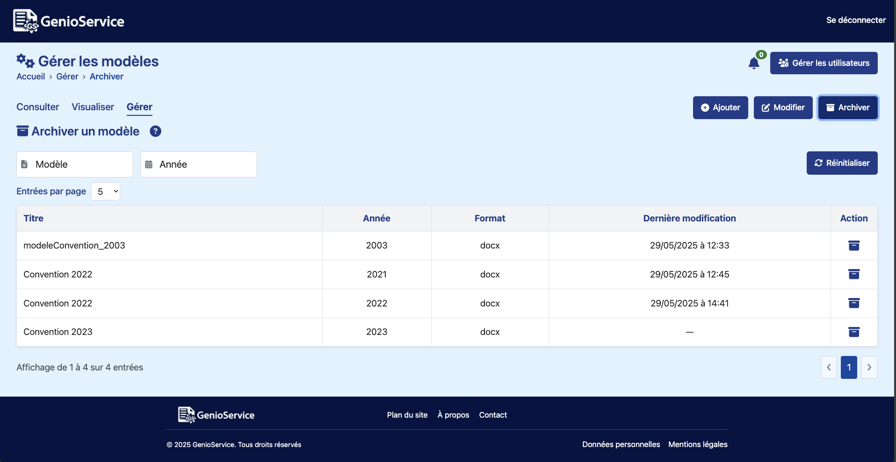
</div>

---

### Fonctionnement - Sous-onglet : Archiver un modèle

1. **Filtres de recherche** :
     - Par **nom de modèle** (texte libre, insensible à la casse et aux accents)
     - Par **année** (champ numérique avec datalist dynamique)
     - Bouton **Réinitialiser** pour rétablir tous les filtres

2. **Affichage des modèles** :
     - Tableau dynamique avec colonnes : **Titre**, **Année**, **Format**, **Dernière modification**, **Action**
     - Choix du nombre d’entrées par page (5, 10, 15)
     - Pagination dynamique

3. **Archivage d’un modèle** :
     - Icône 🗃️ dans la colonne "Action" (archive)
     - Clic ouvre une **modale de confirmation** affichant le **nom du modèle à archiver**
     - Boutons :
       - **Annuler** : fermeture sans action
       - **Archiver** : vérification d’usage, puis suppression (si non utilisé)

4. **Suppression conditionnelle** :
     - Avant la suppression, appel à `/conventionServices/{id}/isUsed`
     - Si le modèle est utilisé dans une convention, l’archivage est bloqué
     - Sinon, suppression via `DELETE /conventionServices/{id}`

5. **Retour utilisateur** :
     - Affichage d’un message temporaire de succès ou d’erreur
     - Rafraîchissement de la liste sans rechargement de page

---

### Exigences fonctionnelles - Sous-onglet : Archiver un modèle

- Accès restreint au **rôle GESTIONNAIRE**
- Confirmation obligatoire via **modale**
- Un modèle archivé est retiré de la liste active (filtrage `!m.archived`)
- Blocage si le modèle est encore utilisé dans une convention

---

### Exigences techniques - Sous-onglet : Archiver un modèle

- **Composant Angular** : `SupprimerModeleComponent`
- **CSS** :
  - `supprimer-modele.component.css`
  - `modal-box.css`, `tables-common.css`, `header.css`, etc.
- **APIs** :
  - `GET /conventionServices` (chargement)
  - `GET /conventionServices/{id}/isUsed` (vérification d’usage)
  - `DELETE /conventionServices/{id}` (suppression réelle)
- **Pagination** :
  - Calculée dynamiquement avec `paginatedModeles`
- **Accessibilité** :
  - `aria-modal`, `aria-label`, `aria-live`, navigation clavier, focus automatique
- **Messages & UX** :
  - Composants `callout-success` ou `callout-error` en haut de page
  - Icône archive explicite, modale claire, focus géré après action

---

### Exemple de message de succès

> ✅ Le modèle `modeleConvention_2022` a bien été archivé.

---

### Exemple de message d’erreur

> ⚠️ Ce modèle est actuellement utilisé dans une convention. Il ne peut pas être archivé.

---

### Accès restreint - Sous-onglet : Archiver un modèle

- **Rôle requis** : GESTIONNAIRE
- Fonctionnalité totalement masquée pour les autres rôles

## Écran de gestion des utilisateurs – Gestionnaire

### Objectif de la page de gestion des utilisateurs – Gestionnaire

Permet aux **Gestionnaires** d’administrer les comptes utilisateurs de la plateforme GenioService.
L’écran permet de visualiser, filtrer, activer/désactiver, modifier ou supprimer des comptes.

C’est l’unique interface d’administration des rôles et statuts des utilisateurs.

---

### Aperçu de la page de gestion des utilisateurs – Gestionnaire

<!-- markdownlint-disable MD033 -->
<div>
  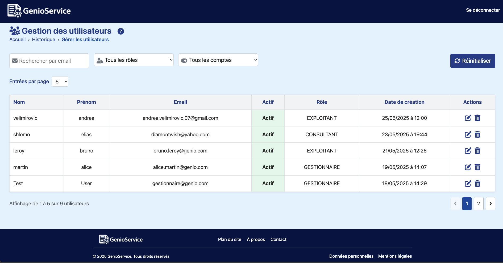
</div>

---

### Fonctionnement de la page de gestion des utilisateurs – Gestionnaire

- Liste paginée de tous les comptes utilisateurs enregistrés
- Filtres disponibles :
  - **Email** (champ texte)
  - **Rôle** : Consultant, Gestionnaire, Exploitant, ou “NONE” pour les comptes en attente
  - **Statut du compte** : Actif / Non actif
- Colonnes affichées :
  - Nom, Prénom, Email
  - Statut (Actif / Inactif)
  - Rôle attribué
  - Date de création du compte
- Pour chaque utilisateur :
  - **Modifier** : ouvre une modale pour éditer le rôle et le statut
  - **Supprimer** : ouvre une modale de confirmation
- Une **modale d’aide** ❔ en haut à droite explique le fonctionnement général de la page
- Un fil d’Ariane dynamique indique depuis quel écran l’administration a été ouverte (`queryParams.source`)

---

### Exigences fonctionnelles de la page de gestion des utilisateurs – Gestionnaire

- **Rôle requis** : Gestionnaire uniquement
- Actions possibles :
  - Activer ou désactiver un compte
  - Modifier le rôle de l’utilisateur (via menu déroulant)
  - Supprimer un compte définitivement
- La **modale de modification** permet :
  - De voir les infos statiques (Nom, Prénom, Email)
  - De basculer l’activation (toggle)
  - De modifier le rôle via `select`
- Un bouton **Réinitialiser** permet de vider tous les filtres

---

### Accessibilité de la page de gestion des utilisateurs – Gestionnaire

- Icônes annotées (`aria-label`, `aria-hidden`)
- Modales accessibles (`role="dialog"`, `aria-modal`, `aria-labelledby`)
- Navigation clavier : `Tab`, `Enter`, `Esc`
- Affichage dynamique du rôle connecté et de l'origine de navigation
- Tous les boutons ont des alternatives textuelles `sr-only` pour les lecteurs d’écran

---

### Exigences techniques de la page de gestion des utilisateurs – Gestionnaire

- **Framework** : Angular 17
- **Composant principal** : `GestionUtilisateursComponent`
- **Requêtes API** :
  - `GET /api/utilisateurs` (liste complète)
  - `PUT /api/utilisateurs/:id/admin-update` (modification)
  - `DELETE /api/utilisateurs/:id` (suppression)
- **Filtrage local** en JS sur :
  - Email
  - Rôle (`CONSULTANT`, `EXPLOITANT`, etc.)
  - Statut (`actif: true / false`)
- **Pagination** configurable (5, 10, 15)
- **Sécurité** :
  - Contrôle strict du rôle Gestionnaire
  - Backend vérifie les droits à chaque opération
- **Modales** gérées dynamiquement :
  - `showEditModal` pour la modification
  - `userToDelete` pour la confirmation de suppression
- **Design & UX** :
  - Badge vert pour les comptes actifs
  - Tri par date de création (du plus récent au plus ancien)
  - Message de confirmation après modification ou suppression
  - Réactivité immédiate de la table après chaque action

---

### Résumé des actions

| Action       | Accessible | Modal ? | Requête API                    |
|--------------|------------|---------|-------------------------------|
| Modifier     | Oui        | Oui     | `PUT /api/utilisateurs/:id/admin-update` |
| Supprimer    | Oui        | Oui     | `DELETE /api/utilisateurs/:id` |
| Activer      | Oui        | Oui     | Incluse dans la requête PUT   |
| Filtrer      | Oui        | Non     | Traitement local              |

---

### Éléments d’assistance

- ❔ Bouton d’aide avec modale : fonctionnement général
- Fichier breadcrumb (`breadcrumbItems`) généré dynamiquement selon `queryParams.source` :
  - `?source=historique` → fil d’Ariane : Accueil > Historique > Gérer les utilisateurs
  - `?source=consulter` → Accueil > Modèles disponibles > Gérer les utilisateurs
  - `?source=gerer` → Accueil > Administration des modèles > Gérer les utilisateurs

---

## Page – Plan du site

### Objectif de la page Plan du site

Permet aux utilisateurs (connectés ou non) d’avoir une **vue d’ensemble de la structure de l’application GenioService**, incluant :

- L’ensemble des pages accessibles (accueil, connexion, inscription…)
- Les actions spécifiques possibles selon les rôles
- Les restrictions d’accès affichées clairement via une modale

Cette page améliore la compréhension de l’architecture et des droits associés à chaque rôle (Consultant, Exploitant, Gestionnaire).

---

### Aperçu de la page Plan du site

<!-- markdownlint-disable MD033 -->
<div>
  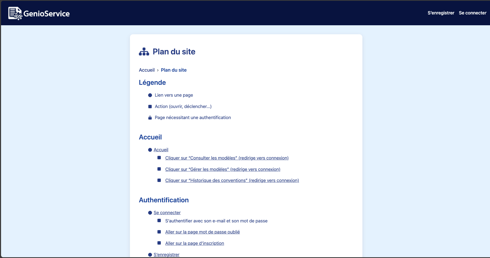
</div>

---

### Fonctionnement de la page Plan du site

- La page affiche une arborescence complète de toutes les sections du site :
  - **Accueil** : redirection vers les grandes sections
  - **Authentification** : pages de connexion, inscription, mot de passe oublié, réinitialisation
  - **Pages par rôle** :
    - Consultant : uniquement “Consulter les modèles”
    - Exploitant : consultation + visualisation de l’historique
    - Gestionnaire : accès à toutes les fonctionnalités (consultation, historique, gestion des utilisateurs, modèles, notifications)
  - **Bas de page** : liens vers les mentions légales, à propos, plan du site, etc.
- Une **légende** en haut permet de comprendre les icônes :
  - 🔵 lien vers une page
  - ⬛ action utilisateur (clic, ouverture)
  - 🔒 nécessite une authentification
- Lorsqu’une action réservée à un rôle est cliquée par un utilisateur non autorisé, une **modale “Accès restreint”** s’affiche.
- Le bouton “Fermer” referme la modale et remet l’utilisateur sur la même page.

---

### Exigences fonctionnelles de la page Plan du site

- **Accès ouvert à tous** (même sans connexion)
- Les actions accessibles dépendent du rôle utilisateur (simulées ici avec des boutons et une modale)
- Les boutons de type `fake-link` déclenchent une modale expliquant l’absence de droit
- L’affichage s’adapte automatiquement selon l’état de connexion via la propriété `userRole` (non connectée ou rôle défini)
- L’ordre des sections suit l’architecture réelle du site

---

### Exigences techniques de la page Plan du site

- **Framework** : Angular 17
- **Composant** : `PlanDuSiteComponent` (standalone)
- **Imports** :
  - `NgIf`, `RouterLink` pour la logique de rôle et navigation
  - `BreadcrumbComponent` pour le fil d’Ariane
- **Affichage conditionnel** :
  - `modalVisible` : contrôle l'affichage de la modale d’accès restreint
  - Méthodes `showModal()` et `closeModal()` déclenchent/ferment la modale
- **Accessibilité** :
  - Modale : `role="dialog"`, `aria-modal="true"`, `aria-labelledby`
  - Icônes annotées via `aria-hidden`
  - Texte lisible par lecteur d’écran (`sr-only`)
- **Styles appliqués** :
  - `plan-du-site.component.css`
  - `header.css`, `auth-shared.css`, `modal-box.css`

---

### Éléments supplémentaires

- Ce composant ne nécessite pas d’appel API.
- Peut être affiché à tout moment, même sans connexion.
- Aide les utilisateurs à comprendre **ce qu’ils peuvent faire selon leur rôle**.
- Cette page sert aussi de **point de test UX** pour la navigation et l'accessibilité.

---

## Page – À propos de GenioService

### Objectif de la page À propos de GenioService

Présenter la **finalité globale** de l’application GenioService, ses **fonctionnalités principales** et les **bénéfices concrets** pour les utilisateurs. Cette page a pour but de familiariser les utilisateurs avec l’outil avant même la connexion, et de rassurer sur sa sécurité, sa simplicité et sa valeur ajoutée.

---

### Aperçu de la page À propos de GenioService

<div>
  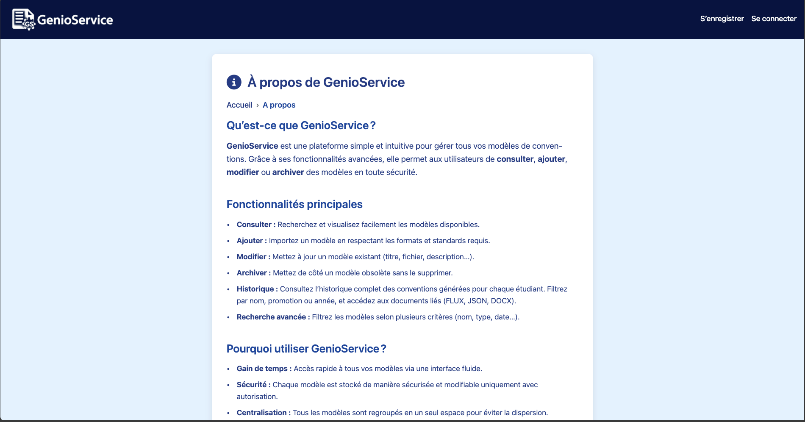
</div>

---

### Fonctionnement de la page À propos de GenioService

- Accessible sans authentification, directement depuis le **footer** ou l’URL `/a-propos`.
- Le contenu est organisé en sections :
  - **Présentation de GenioService** : définition de la plateforme
  - **Fonctionnalités principales** : liste des actions disponibles (consulter, ajouter, modifier…)
  - **Bénéfices** : sécurité, gain de temps, traçabilité
  - **Équipe projet** : courte description de l’équipe derrière l’outil
  - **Contact** : lien mailto pour écrire à l’équipe GenioService
- Chaque fonctionnalité (comme "Archiver", "Historique") est décrite de manière claire et orientée utilisateur.
- Les éléments visuels (icônes, balisage HTML) sont pensés pour une lecture fluide et accessible.

---

### Exigences fonctionnelles de la page À propos de GenioService

- Page publique (pas besoin d’être connecté)
- Accessible depuis :
  - Le **footer** de chaque page
  - L'URL `/a-propos`
- Texte informatif uniquement, sans formulaire ni action utilisateur
- Lien fonctionnel vers l’adresse mail de contact
- Intégration du **fil d’Ariane** en haut de page

---

### Exigences techniques de la page À propos de GenioService

- **Framework** : Angular 17
- **Composant** : `AboutComponent` (standalone)
- **Imports** :
  - `RouterLink` pour le breadcrumb
  - `NgIf` pour affichage conditionnel
  - `BreadcrumbComponent`
- **Structure HTML** :
  - `main.about-container`
  - `section.about-section` pour chaque bloc thématique
- **Accessibilité** :
  - Balises sémantiques `h2`, `ul`, `p`
  - Icônes marquées `aria-hidden="true"`
  - `aria-labelledby` lié à l’identifiant `#page-title` pour contextualiser la navigation
- **Contact mail** :
  - Lien `mailto:genioservice3@gmail.com` intégré avec protection typographique (`&#64;`)

---

### Métadonnées

- **Dernière mise à jour** : 29 mai 2025
- **Rédactrice** : Elsa HADJADJ
- **Version** : 1.0

## Page – Contact

### Objectif de la page Contact

Permettre aux visiteurs du site, connectés ou non, de **contacter le développeur** du projet GenioService en cas de question, retour, ou simple message. La page donne aussi un **contexte clair sur le projet universitaire**, son cadre pédagogique et ses technologies.

---

### Aperçu de la page Contact

<!-- markdownlint-disable MD033 -->
<div>
  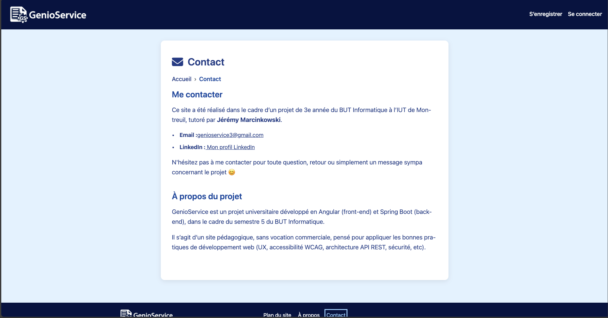
</div>

---

### Fonctionnement de la page Contact

- Accessible **publiquement** via le footer ou `/contact`.
- Deux sections principales :
  1. **Me contacter** :
       - Adresse email cliquable (mailto)
       - Lien LinkedIn vers le profil du développeur
       - Contexte : projet de 3e année du BUT Informatique, tutoré par M. Marcinkowski
       - Texte d’introduction encourageant le contact (ton cordial et humain)
  2. **À propos du projet** :
       - Détail sur le stack technique (Angular + Spring Boot)
       - Objectif purement pédagogique
       - Application des bonnes pratiques de développement web

---

### Exigences fonctionnelles de la page Contact

- Page disponible sans authentification
- Lien mail : `mailto:genioservice3@gmail.com`
- Lien LinkedIn sécurisé (avec `target="_blank"` et `rel="noopener"`)
- Présence d’un fil d’Ariane (`Accueil > Contact`)
- Aucun formulaire ou interaction utilisateur : **simple page informative**

---

### Exigences techniques de la page Contact

- **Framework** : Angular 17
- **Composant** : `ContactComponent` (standalone)
- **Imports** :
  - `RouterLink` pour la navigation
  - `NgIf` pour la logique conditionnelle éventuelle
  - `BreadcrumbComponent`
- **Accessibilité** :
  - `aria-labelledby="page-title"` pour le `main`
  - Icônes décoratives avec `aria-hidden="true"`
  - Mail et lien LinkedIn balisés avec attributs d’accessibilité
- **Email protégé** : `genioservice3&#64;gmail.com` (évite le scraping automatique)
- **Responsive** : mise en page fluide en desktop et mobile
- **Sécurité** :
  - Ouverture du lien LinkedIn dans un nouvel onglet
  - Aucune donnée utilisateur saisie ici (pas de backend requis)

---

## Page – Politique de confidentialité

### Objectif de la page Politique de confidentialité

Informer l’utilisateur des engagements de GenioService concernant la protection des données personnelles, les droits des utilisateurs, la nature des données collectées et l’usage des cookies. Cette page est obligatoire dans un cadre RGPD.

---

### Aperçu de la page Politique de confidentialité
<!-- markdownlint-disable MD033 -->
<div>
  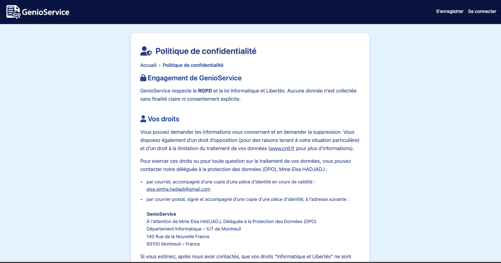
</div>

---

### Fonctionnement de l’écran de la page Politique de confidentialité

- Accessible publiquement depuis le footer (lien « Politique de confidentialité »).
- Lien également présent dans le formulaire d’inscription (via la case à cocher obligatoire) :
  > « Je déclare avoir pris connaissance et accepte la [Politique de confidentialité](/confidentialite) »
- Structure en **6 sections explicites** :
  1. **Engagement de GenioService** : conformité stricte au RGPD, aucune collecte sans consentement.
  2. **Vos droits** : possibilité de demander l’accès, la rectification, l’effacement ou la limitation des données.
  - Coordonnées de la DPO (Elsa Hadjadj) fournies.
  - Justificatif d’identité exigé pour valider la demande.
  3. **Données collectées** : uniquement les données nécessaires à l’inscription et à l’authentification.
  - Aucune donnée sensible stockée en clair ni utilisée à d'autres fins.
  4. **Utilisation des cookies** :
  - Uniquement des cookies techniques nécessaires à la session (pas de cookies publicitaires).
  5. **Gérer vos préférences** :
  - Instructions pour configurer les cookies via les navigateurs (Chrome, Firefox, Safari…).
  6. **Liens utiles** :
  - Renvoi vers le site de la CNIL pour approfondir ses droits et démarches.

- Les données personnelles sont conservées pendant une durée maximale de **1 an après la dernière activité** sur le compte. Passé ce délai, le compte est automatiquement désactivé.
- Si aucune demande de suppression n’est formulée, les données sont conservées pendant encore **5 ans à des fins d’archivage pédagogique**, puis automatiquement supprimées ou anonymisées de manière irréversible.
- À tout moment, l’utilisateur peut **demander la suppression immédiate de ses données** en contactant la Déléguée à la Protection des Données (DPO) à l’adresse suivante : <a href="mailto:elsa.simha.hadjadj@gmail.com">elsa.simha.hadjadj@gmail.com</a>.
- Conformément au principe de **minimisation** du RGPD, GenioService ne collecte que les données strictement nécessaires au fonctionnement de la plateforme.

---

### Exigences fonctionnelles de la page Politique de confidentialité

- Lien accessible dans le footer de toutes les pages.
- Tous les liens extérieurs ouvrent un nouvel onglet (`target="_blank"`, `rel="noopener"`).
- Mention claire de l’adresse du DPO avec deux canaux de contact (email + courrier postal).
- Mention des types de données collectées pour chaque fonctionnalité.
- Informations sur les droits de l’utilisateur (conformément à la CNIL).
- Mention explicite de l’absence de traceurs publicitaires.

---

### Exigences techniques de la page Politique de confidentialité

- **Framework** : Angular 17
- **Composant** : `DpoComponent` ou `DonnéesPersonnellesComponent` (standalone)
- **Imports** :
  - `NgIf`, `RouterLink`, `NgFor` si nécessaires
  - `BreadcrumbComponent`
- **Accessibilité** :
  - Utilisation de `aria-labelledby` pour le `<main>`
  - Icônes décoratives en `aria-hidden="true"`
  - Liens clairs et lisibles, sans pièges au clic
- **Sécurité** :
  - Pas de collecte de données actives (pas de formulaire)
  - Protection de l’adresse email avec entité HTML : `elsa.simha.hadjadj&#64;gmail.com`
- **Responsive** : contenu adapté aux tailles d’écran, bonne lisibilité mobile
- **Respect du RGPD** :
  - DPO nommément identifié
  - Modalités d’exercice des droits clairement listées
  - Liens vers la CNIL (source officielle)

---

### Complément

Cette page est essentielle pour :

- garantir la conformité **juridique** du site (RGPD),
- rassurer les utilisateurs sur la **sécurité** de leurs données,
- valoriser la **transparence** du projet GenioService.

---

## Page – Mentions légales

### Objectif de la page Mentions légales

Présenter les informations légales obligatoires liées à l'éditeur du site GenioService dans un cadre académique. Cette page garantit la transparence sur l’identité de l’auteur, les technologies utilisées, la propriété du code source, et les conditions d’usage du site.

---

### Aperçu de la page Mentions légales

<!-- markdownlint-disable MD033 -->
<div>
  
</div>

---

### Fonctionnement de la page Mentions légales

- Accessible depuis le **footer** sur toutes les pages via le lien « Mentions légales ».
- Contenu réparti en **6 sections** principales :
  1. **Éditrice du site** : identité de l’auteure (Elsa Hadjadj), encadrement (Jérémy Marcinkowski), et localisation de l’établissement (IUT de Montreuil).
  2. **Technologies utilisées** : framework front-end (Angular), back-end (Spring Boot), responsive design, accessibilité.
  3. **Dépôts GitHub** : liens directs vers les dépôts frontend et backend publics.
  4. **Propriété intellectuelle** : licence Creative Commons **CC BY-NC-SA 4.0** (usage non commercial, attribution requise).
  5. **Hébergement** : site hébergé en France sur un serveur local à des fins pédagogiques, conforme RGPD.
  6. **Green IT** : principes d’éco-conception numérique appliqués au projet.

---

### Exigences de la page Mentions légales

- Affichage clair et accessible des informations légales, à jour.
- Liens extérieurs sécurisés (`target="_blank"` et `rel="noopener"`).
- Mention explicite du cadre universitaire (BUT Informatique – IUT de Montreuil).
- Mention de la licence de partage du code source.
- Accès depuis toutes les pages via le pied de page.

---

### Exigences techniques de la page Mentions légales

- **Composant Angular** : `MentionsLegalesComponent` (standalone)
- **Technos utilisées** :
  - Frontend : Angular (HTML5, CSS3, TypeScript)
  - Backend : Spring Boot (Java, REST API)
- **Imports nécessaires** :
  - `RouterLink`, `NgIf`, `BreadcrumbComponent`
- **Accessibilité** :
  - `<main>` avec `aria-labelledby`
  - Icônes décoratives en `aria-hidden="true"`
- **Responsive** : lisibilité sur petit écran (mobile-first)
- **Sécurité** :
  - Aucun script ou fonctionnalité active sur cette page
  - Liens vérifiés et protégés par `rel="noopener"`

---

### Complément pour la page Mentions légales

Cette page est obligatoire en France, même dans un cadre académique, dès lors qu’un site est mis à disposition d’un public. Elle clarifie la responsabilité éditoriale et le périmètre d’utilisation du projet GenioService.

---

## Page – Conditions Générales d’Utilisation (CGU)

### Objectif de la page Conditions Générales d’Utilisation (CGU)

Présenter les règles d’utilisation du site GenioService et les engagements réciproques entre l’utilisateur et l’éditeur.  
Cette page précise les droits, responsabilités, et modalités d’accès au service, conformément aux bonnes pratiques juridiques en matière de services en ligne.

---

### Aperçu de la page Conditions Générales d’Utilisation (CGU)

<!-- markdownlint-disable MD033 -->
<div>
  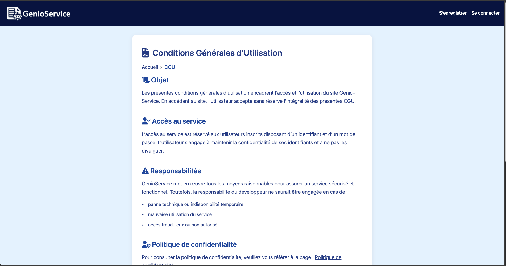
</div>

---

### Fonctionnement de la page Conditions Générales d’Utilisation (CGU)

- Lien permanent dans le footer (`<footer>`) de toutes les pages.
- Lien également présent dans le formulaire d’inscription (case à cocher obligatoire) :
  > « Je déclare avoir pris connaissance et accepte les [Conditions Générales d’Utilisation](/cgu) »
- Contenu structuré en 6 sections :
  1. **Objet** : but et portée des CGU, acceptation des conditions.
  2. **Accès au service** : nécessité d’un compte (email + mot de passe), confidentialité des identifiants.
  3. **Responsabilités** : cas d’exonération (panne, mauvaise utilisation, accès frauduleux).
  4. **Politique de confidentialité** : renvoi vers la page dédiée à la politique de confidentialité.
  5. **Modifications** : possibilité de modification des CGU à tout moment.
  6. **Droit applicable** : droit français, juridiction compétente = Paris.

### Exigences de la page Mentions légales et Conditions Générales d’Utilisation (CGU)

- Texte **clair, synthétique et accessible**, lisible pour tout utilisateur.
- **Lien vers cette page affiché dans le footer**, à côté des mentions légales et politique de confidentialité.
- Lien direct vers la politique de confidentialité dans la section "Politique de confidentialité".
- Page **statique** sans interaction, pour garantir accessibilité et sécurité.
- Mention claire de l’acceptation implicite des CGU lors de l’utilisation du service.

---

### Exigences techniques de la page Conditions Générales d’Utilisation (CGU)

- **Composant Angular** : `ConditionsUtilisationComponent` (`standalone`)
- **Technos utilisées** :
  - Frontend : Angular (HTML5, CSS3, TypeScript)
  - Backend : Spring Boot (Java, REST API)
- **Imports nécessaires** :
  - `RouterLink`, `NgIf`, `BreadcrumbComponent`
- **Accessibilité** :
  - `<main>` avec `aria-labelledby`
  - Icônes décoratives avec `aria-hidden="true"`
- **Responsive design** : texte lisible sur mobile/tablette
- **Sécurité** :
  - Aucun script actif
  - Liens protégés par `rel="noopener"`

---

### Complément pour la page Conditions Générales d’Utilisation (CGU)

Bien que non strictement obligatoire dans un cadre académique, une page CGU est **fortement recommandée** pour tout site qui implique une **création de compte** ou un **service d’authentification**.
Elle permet de définir un cadre clair pour les utilisateurs et de **limiter la responsabilité de l’éditeur** en cas d’usage abusif, d’indisponibilité ou d’erreurs techniques.

---

